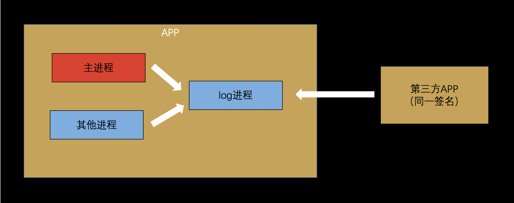

# log--方便好用的日志记录工具
* **跨进程**  
支持跨进程记录日志，多进程通过aidl实现。
* **拦截器**  
支持动态增加日志拦截器。
* **抓取**  
支持同一签名的第三方应用抓取日志。
* **自动拆分**  
android系统日志的长度太长会出现丢失的问题，长度超过3K的将其拆分成多条。

 

### 安装引入
推荐使用 Maven：
```gradle
repositories {
    //...
    maven { url 'http://god-father.club:8081/repository/maven-releases/' }
}

dependencies {
    implementation 'club.godfather.support:log:1.0.0'
}
```

### 快速上手

```Java
import club.godfather.support.log.Lg;
//...
//设置参数
Lg.setLg(new AndroidLgImpl(context));
Lg.setLevel(Log.VERBOSE);
//记录日志
Lg.d(TAG, "log message");
```

如果需要记录日志到文件
```Java
File dir = new File(context.getFilesDir(), "log");
Lg.addInterceptor(new FileRecordInterceptor(dir));
```